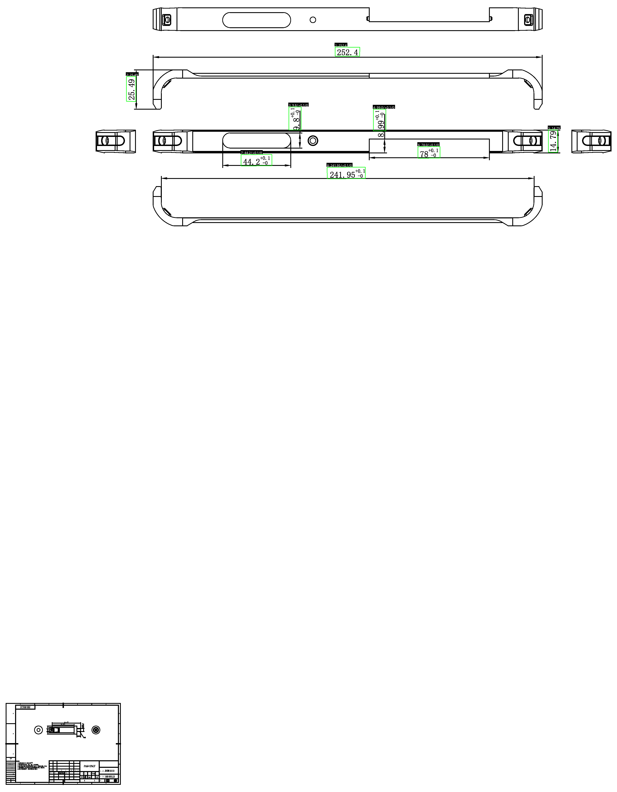

# YOLO OCR 尺寸识别器

基于 YOLO + PaddleOCR 的工程图纸尺寸自动识别系统，能够从工程图纸中自动识别和提取尺寸标注信息。

## 项目简介

本项目是一个智能化的工程图纸尺寸识别工具，结合了目标检测（YOLO）和光学字符识别（OCR）技术，能够自动识别工程图纸中的各类尺寸标注，包括：

- **长度尺寸**：普通线性尺寸
- **直径尺寸**：φ 标注
- **半径尺寸**：R 标注
- **螺纹尺寸**：M 标注
- **矩形尺寸**：A×B 格式
- **公差标注**：对称公差（±）和非对称公差（+/-）
- **数量标注**：N-尺寸 格式
- **深度标注**：深度值识别

## 演示效果
### 示例 1：多尺寸标注识别


## 核心特性

### 1. 双模型协同检测
- **Model A (YOLO OBB)**：检测图纸中的尺寸标注区域
- **Model B (YOLO Detect)**：检测符号类型（φ/R/M）

### 2. 智能 OCR 识别
- 基于 PaddleOCR v5 的高精度文字识别
- 多角度识别支持（0°/90°/180°/270°）
- 自适应 ROI 扩展，解决公差截断问题
- 智能去噪预处理

### 3. 高级文本解析
- 自动识别主值、公差、数量、深度等信息
- 支持复杂格式解析（如：2-φ4.5+0.03/-0.1）
- 智能修正常见 OCR 错误（6/9 混淆、符号误识别等）

### 4. 智能过滤系统
- 过滤标题栏、序号、人名等非尺寸信息
- 过滤中文标注、比例标注、剖面标记
- 基于 IoU 和位置的重复检测去除

## 技术栈

- **深度学习框架**：Ultralytics YOLO
- **OCR 引擎**：PaddleOCR (ONNX Runtime)
- **图像处理**：OpenCV
- **运行环境**：Python 3.10 + CUDA 12.x

## 安装依赖

```bash
pip install ultralytics onnxruntime-gpu opencv-python-headless
```

**推荐环境**：
- Python 3.10
- CUDA 12.x（GPU 加速）
- 8GB+ 显存（推荐）

## 快速开始

### 基本用法

```bash
python app/yolo_ocr.py --image 输入图片.png --output 结果.json
```

### 启用 GPU 加速

```bash
python app/yolo_ocr.py --image 输入图片.png --output 结果.json --use-gpu
```

### 生成可视化结果

```bash
python app/yolo_ocr.py --image 输入图片.png --output 结果.json --visualize
```

### 调整检测置信度

```bash
python app/yolo_ocr.py --image 输入图片.png --output 结果.json --det-conf 0.1
```

## 输出格式

识别结果以 JSON 格式输出，包含以下信息：

```json
[
  {
    "id": 1,
    "text": "φ4.5+0.03/-0.1",
    "raw_text": "4.5 +0.03 -0.1",
    "confidence": 0.95,
    "ocr_confidence": 0.92,
    "rect": {
      "x": 100,
      "y": 200,
      "width": 80,
      "height": 30
    },
    "obb_points": [[...], [...], [...], [...]],
    "category": "直径(φ)",
    "theoretical_value": 4.5,
    "upper_tolerance": 0.03,
    "lower_tolerance": -0.1,
    "quantity": null,
    "tolerance_type": "asymmetric"
  }
]
```

## 项目结构

```
yolo_ocr/
├── app/                      # 主程序目录
│   ├── yolo_ocr.py          # 核心识别程序
│   ├── preprocessing.py     # 图像预处理
│   └── visualizer.py        # 可视化工具
├── onnxocr/                 # OCR 模块
│   ├── onnx_paddleocr.py   # PaddleOCR ONNX 推理
│   └── models/             # OCR 模型文件
│       ├── ppocrv5/        # PaddleOCR v5 模型
│       └── ch_ppocr_server_v2.0/  # PaddleOCR v2 模型
├── best-v3.onnx            # YOLO 检测模型 v3
└── README.md               # 项目说明文档
```

## 功能开关

在 `app/yolo_ocr.py` 中可以调整以下功能开关：

```python
ENABLE_SYMBOL_ERASE = False      # 是否在 OCR 前擦除符号
ENABLE_ROI_EXPAND = True         # 是否扩大 OCR 识别区域
ENABLE_PREPROCESSING = False     # 是否进行去噪预处理
ENABLE_PERSPECTIVE_CROP = False  # 是否使用透视变换裁剪
ENABLE_DEBUG_SAVE_ROI = True     # 是否保存调试图片
```

## 性能优化

### CPU 模式（默认）
- 适合小批量处理
- 无需 GPU 环境
- 处理速度：约 5-10 秒/张

### GPU 模式（推荐）
- 需要 CUDA 支持
- 处理速度：约 2-5 秒/张
- 适合批量处理

## 常见问题

### 1. 识别结果不准确？
- 尝试调整 `--det-conf` 参数（默认 0.05）
- 检查图片分辨率是否足够（推荐 1920x1080 以上）
- 启用 `ENABLE_PREPROCESSING` 进行去噪

### 2. 公差被截断？
- 确保 `ENABLE_ROI_EXPAND = True`
- 系统会自动扩大识别区域

### 3. 符号识别错误？
- Model B 会自动检测 φ/R/M 符号
- 如果误检，可以关闭 `ENABLE_SYMBOL_ERASE`

### 4. 内存不足？
- 使用 CPU 模式（不加 `--use-gpu`）
- 降低图片分辨率

## 技术细节

### 识别流程

1. **图像预处理**：椒盐噪声检测 + 双边滤波（可选）
2. **YOLO 检测**：定位尺寸标注区域（OBB 格式）
3. **ROI 裁剪**：智能裁剪并扩展识别区域
4. **符号检测**：检测 φ/R/M 符号类型
5. **OCR 识别**：多角度文字识别
6. **文本解析**：提取主值、公差、数量等信息
7. **智能过滤**：去除非尺寸标注
8. **去重处理**：基于 IoU 和位置的重复去除

### 核心算法

- **自适应 ROI 扩展**：根据文本截断情况动态调整识别区域
- **6/9 混淆修正**：基于图像特征判断 6 和 9 的混淆
- **公差合理性检查**：修正 "-0" 被误识别为 "-9" 等问题
- **多层去重机制**：IoU 去重 + 数值位置去重

## 许可证

本项目仅供学习和研究使用。

## 致谢

- [Ultralytics YOLO](https://github.com/ultralytics/ultralytics)
- [PaddleOCR](https://github.com/PaddlePaddle/PaddleOCR)
- [ONNX Runtime](https://github.com/microsoft/onnxruntime)

## 联系方式

如有问题或建议，欢迎提交 Issue。
